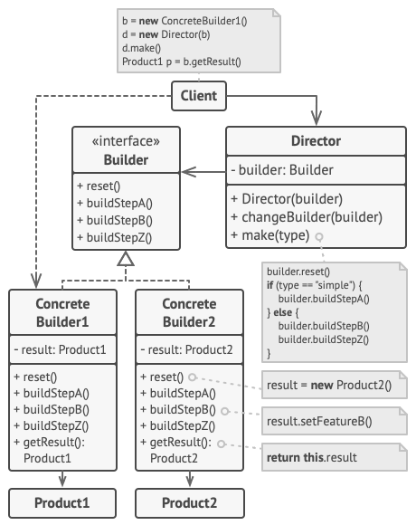

**TL;DR:** The [Builder Pattern](https://rust-unofficial.github.io/patterns/patterns/creational/builder.html) is a creational design pattern that lets you construct complex objects step by step. 

Instead of creating a massive, confusing constructor with a dozen parameters (half of which might be optional or empty), you extract the object construction code out of its own class and into separate objects called *builders*.


### Core Concept
Imagine you are ordering a custom PC. You don't just ask for "A PC with everything." You specify the CPU, then the RAM, then the storage, and finally say "build it." 

The Builder pattern works exactly like this. You chain together configuration methods to set up your object exactly how you want it, and finish with a `.build()` method that validates your choices and hands you the final, immutable object.




### The Rust Way
As highlighted in the [Rust Design Patterns](https://rust-unofficial.github.io/patterns/patterns/creational/builder.html) documentation you have open, this pattern is incredibly popular in Rust. Because Rust **does not have function overloading or default arguments**, creating structs with lots of optional fields can get messy. The Builder pattern solves this elegantly.

Here is a simplified, fully runnable example:

```rust
// 1. The Complex Object
#[derive(Debug)]
pub struct ServerConfig {
    host: String,
    port: u16,
    tls_enabled: bool,
}

impl ServerConfig {
    // Helper to easily start building
    pub fn builder() -> ServerConfigBuilder {
        ServerConfigBuilder::default()
    }
}

// 2. The Builder
// We use Option to track which fields the user actually set
#[derive(Default)]
pub struct ServerConfigBuilder {
    host: Option<String>,
    port: Option<u16>,
    tls_enabled: Option<bool>,
}

// 3. The Builder Implementation
impl ServerConfigBuilder {
    // Chaining methods take `mut self` and return `Self`
    pub fn host(mut self, host: &str) -> Self {
        self.host = Some(host.to_string());
        self
    }

    pub fn port(mut self, port: u16) -> Self {
        self.port = Some(port);
        self
    }

    pub fn tls(mut self, enabled: bool) -> Self {
        self.tls_enabled = Some(enabled);
        self
    }

    // The Final Build Step (Applying defaults for missing fields)
    pub fn build(self) -> ServerConfig {
        ServerConfig {
            host: self.host.unwrap_or_else(|| String::from("127.0.0.1")),
            port: self.port.unwrap_or(8080),
            tls_enabled: self.tls_enabled.unwrap_or(false),
        }
    }
}

// 4. Usage
fn main() {
    // Constructing a complex object fluently!
    let config = ServerConfig::builder()
        .host("api.mywebsite.com")
        .tls(true)
        // Notice we skipped `port`, so it will use the default (8080)
        .build();

    println!("{:#?}", config);
}
```

### Why Use It?
* **Readability**: `Builder::new().port(443).tls(true).build()` is much easier to read than `ServerConfig::new("localhost", 443, true)`.
* **Immutability**: You can use a mutable builder to set things up, but `.build()` returns a fully locked-down, immutable instance of your struct.
* **Separation of Concerns**: It prevents your main struct from being bloated with validation logic and complex initialization steps.

