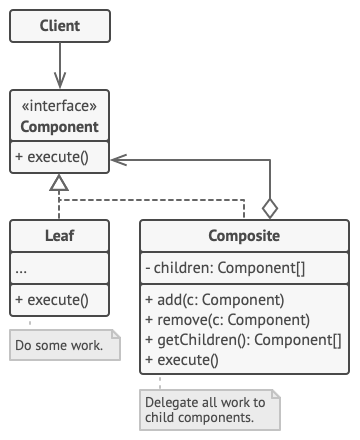

**TL;DR:** The [Composite Pattern](https://refactoring.guru/design-patterns/composite) is a structural design pattern that lets you bundle objects into tree-like structures and treat both individual items and groups of items identically!

* **The Story:** Think of a computer file system; because files (leaves) and folders (composites) share the exact same interface, calling a single `.get_size()` method on the root folder will magically and recursively query everything inside!
* **The Rust Way:** You define a shared `Component` trait, implementing it for `Leaf` structs (the base data) and `Composite` structs (containers holding a `Vec<Box<dyn Component>>` of children).

**Steps to Implement:**
1. **Define** a shared `Component` trait with a common method (e.g., `execute()`).
2. **Build** `Leaf` structs to handle the baseline work for individual items.
3. **Create** `Composite` containers that store lists of `Box<dyn Component>` and recursively delegate the `execute()` calls to their children.


The **Composite Pattern** is a structural design pattern that allows you to organize objects into tree-like structures to represent part-whole hierarchies. It enables clients to treat individual objects and groups of objects (compositions) in the exact same way.


### Core Concept
Think of a computer file system. You have **Files** (simple objects) and **Folders** (complex objects). A folder can contain files, but it can also contain *other folders*. 

If you want to calculate the total size of a folder, you don't need to write different logic for files vs. sub-folders. You just ask everything inside to "calculate size." The files return their own size, and the sub-folders recursively ask their contents for their sizes.


### The Classic Structure



### Key Components

* **Component (`«interface»`)**: The common interface declared for both simple and complex elements (e.g., an `execute()` method).
* **Leaf**: The basic building block of the tree. It implements the Component interface but has no sub-elements (children). It performs the actual work.
* **Composite**: A container that holds an array of `Component` children (which can be Leaves or other Composites). When it receives a request, it delegates the work to its children. It implements the `Component` interface by delegating operations to its child components.

### How It Works

By sharing a common interface, the client code does not need to worry about whether it is interacting with a single object or an entire branch of the tree. When the client calls a method on a Composite, the Composite iterates over its children, calling the same method on each one. This recursion continues down the tree until the operation is handled by the Leaf nodes.

### Common Use Cases

* **File Systems:** Treating individual files and nested folders uniformly (e.g., calculating the total directory size).
* **UI Frameworks:** Managing simple widgets (buttons, text fields) and container widgets (panels, windows) using a single rendering approach.
* **Document Object Models (DOM):** Representing HTML or XML documents where elements can contain text nodes or other nested elements.

---

### Implementation in Rust
Here is how you would implement the exact structure from your diagram in Rust using traits and dynamic dispatch. 

```rust
// 1. The Component Interface
trait Component {
    fn execute(&self);
}

// 2. The Leaf (Does the actual work)
struct Leaf {
    name: String,
}

impl Component for Leaf {
    fn execute(&self) {
        println!("  Leaf '{}' is doing some work.", self.name);
    }
}

// 3. The Composite (Delegates to children)
struct Composite {
    name: String,
    children: Vec<Box<dyn Component>>,
}

impl Composite {
    fn new(name: &str) -> Self {
        Composite { name: name.to_string(), children: Vec::new() }
    }

    fn add(&mut self, component: Box<dyn Component>) {
        self.children.push(component);
    }
}

impl Component for Composite {
    fn execute(&self) {
        println!("Composite '{}' delegating work to children:", self.name);
        for child in &self.children {
            child.execute(); // Magic happens here: treats Leaf and Composite identically
        }
    }
}

fn main() {
    // Build the tree
    let mut root = Composite::new("Root_Folder");
    
    let mut sub_folder = Composite::new("Sub_Folder");
    sub_folder.add(Box::new(Leaf { name: "File_1.txt".to_string() }));
    sub_folder.add(Box::new(Leaf { name: "File_2.txt".to_string() }));

    root.add(Box::new(Leaf { name: "Root_File.txt".to_string() }));
    root.add(Box::new(sub_folder));

    // Execute the entire tree with one call
    root.execute();
}
```

### Pro-Tip: Enums vs. Traits
Just like with the Interpreter pattern, if your tree hierarchy is completely fixed and known ahead of time, you can ditch the `Box<dyn Component>` and use a **recursive Enum** instead (e.g., `enum Node { File(String), Folder(Vec<Node>) }`).

However, if you are building an extensible system (like a UI library where users can define their own custom widgets to inject into your DOM tree), the **Trait** approach shown above is the way to go!
