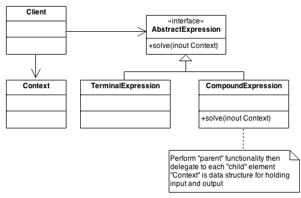

**TL;DR:** The Interpreter pattern turns grammar rules into an executable tree structure! 
Think of it like a LEGO instruction manual where every single block magically knows how to 
read its own shape and connect itself to the next piece to finish the toy. 


The **Interpreter Pattern** is a behavioral design pattern used to define a grammatical representation for a language and an interpreter to deal with this grammar. It is most commonly used to parse and evaluate mathematical expressions or simple domain-specific languages (DSLs).

### Core Concept
The pattern works by defining a class hierarchy for the "grammar" of the language. Each rule in the grammar is represented by a class. These classes are typically organized into a **Tree Structure** (Composite Pattern) where:
* **Terminal Expressions**: The basic building blocks (like a literal number `5`).
* **Non-Terminal Expressions**: Complex rules that combine other expressions (like an addition `+` operation).





---

### Implementation in Rust


In Rust, the most efficient way to implement this is using **Enums** and **Recursive Functions**, rather than a heavy class-based hierarchy.

Here is the fully runnable, simplified Rust code using Enums to evaluate
the math expression `(10 + 5) - 2`. For a deeper dive into these concepts, 
you can reference the [Rust Design Patterns documentation](https://rust-unofficial.github.io/patterns/). 


```rust
// The "Grammar" rules for our mini math language
enum Expression {
    Number(i32),
    Add(Box<Expression>, Box<Expression>),
    Subtract(Box<Expression>, Box<Expression>),
}

impl Expression {
    // The Interpreter: recursively evaluates the tree
    fn interpret(&self) -> i32 {
        match self {
            Expression::Number(n) => *n,
            Expression::Add(left, right) => left.interpret() + right.interpret(),
            Expression::Subtract(left, right) => left.interpret() - right.interpret(),
        }
    }
}

fn main() {
    // Step 1: Build the abstract syntax tree for: (10 + 5) - 2
    let math_tree = Expression::Subtract(
        Box::new(Expression::Add(
            Box::new(Expression::Number(10)),
            Box::new(Expression::Number(5)),
        )),
        Box::new(Expression::Number(2)),
    );

    // Step 2: Interpret and execute the tree
    let result = math_tree.interpret();
    println!("The evaluated result is: {}", result); // Outputs: 13
}
```

---

### Why Use It?
* **Extensibility**: You can add new ways to interpret the same tree (e.g., a "PrettyPrinter" or a "TypeChecker") by adding new methods or using the **Visitor Pattern** alongside it.
* **Simplicity**: It’s perfect for simple, stable grammars where a full parser generator (like ANTLR) would be overkill.

### When to Avoid It?
* **Performance**: Deep recursive calls can lead to stack overflows or slow performance on massive trees.
* **Complex Grammars**: If the grammar changes frequently or is highly complex, maintaining dozens of expression classes/variants becomes a nightmare.


